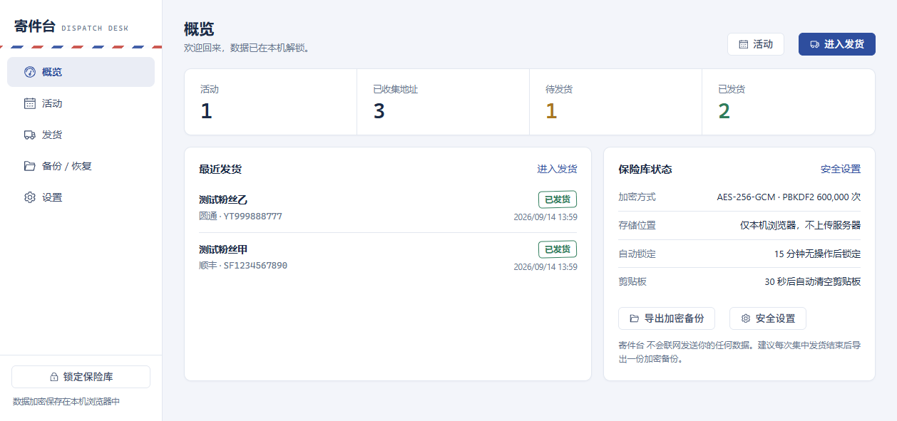
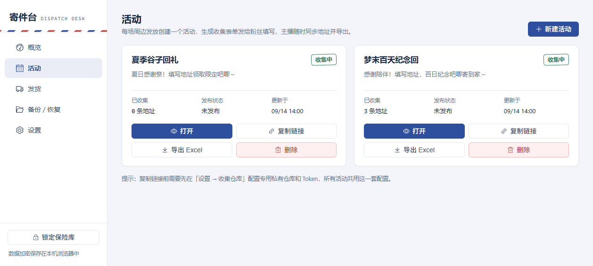
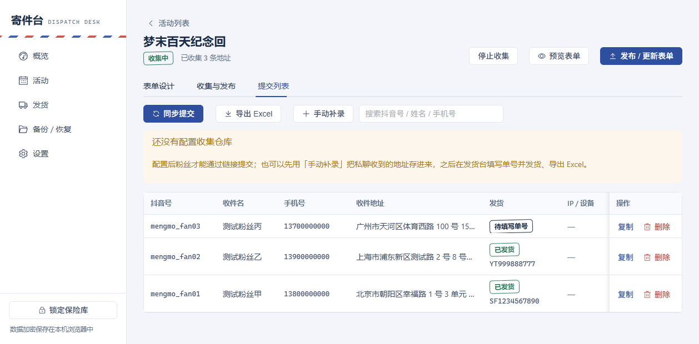
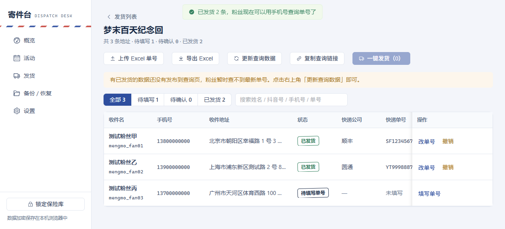
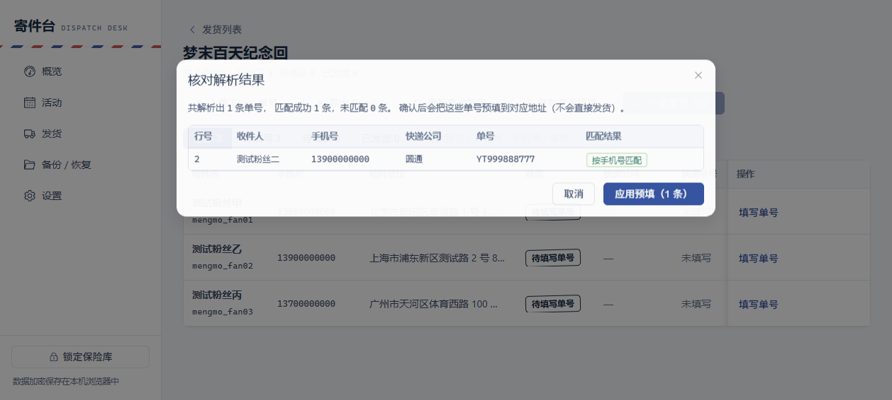
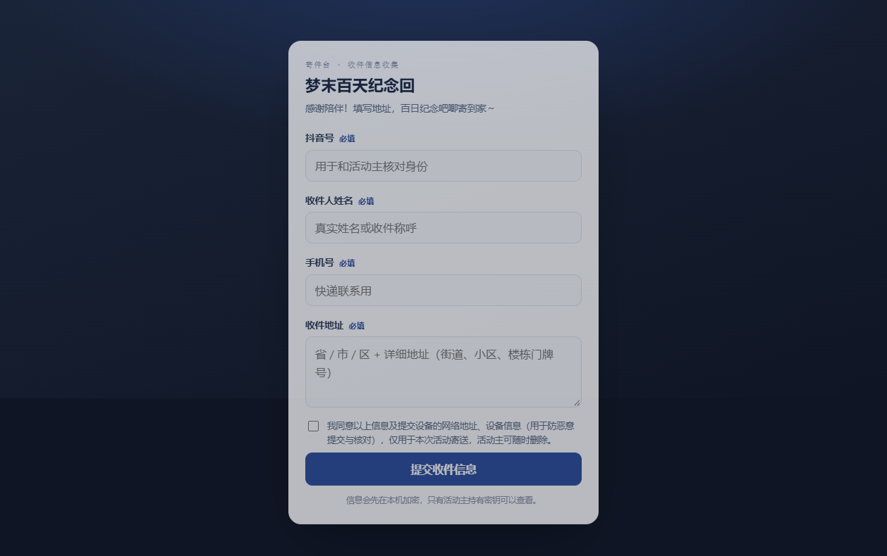
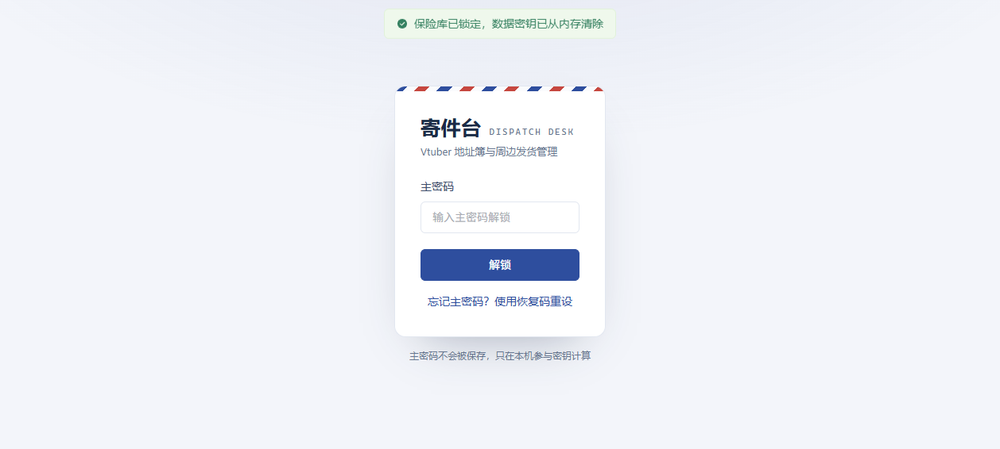

# 寄件台 · Dispatch Desk

<p align="center">
  <a href="TUTORIAL.md"><strong>📖 部署/使用教程点我</strong></a>
</p>

<p align="center">
  
</p>

<p align="center">
  
  
  
  
  
  
</p>

面向 Vtuber 的活动地址收集与周边发货管理工具：**纯前端、零后端、全程加密**。部署在免费的静态托管（GitHub Pages 等）上，粉丝地址只加密保存在「你自己的浏览器」和你名下的「GitHub 私有仓库」里。

粉丝用一条链接提交收件信息 → 地址在粉丝浏览器里加密 → 你本机解密、发货 → 粉丝凭手机号自助查询快递单号。



## 快速使用

**想直接部署使用？看这里 → [部署/使用教程](TUTORIAL.md)**（全程浏览器操作，约 3 分钟，含 30 张实操截图与 Excel 批量发货流程）

简版流程：

1. **部署站点**：打开本仓库 → 右上角 **Use this template** 创建自己的仓库（Public）→ Settings → Pages 选择 **GitHub Actions** → Actions 里运行一次 **Deploy to GitHub Pages**；
2. **配置收集仓库**：新建一个**专用私有仓库** + 只授权它的 Fine-grained Token（Contents: Read and write），在站点「设置 → 收集仓库」里填入并测试连接；
3. **开始收集**：创建活动 → 设计表单（主题色 / 背景图）→ 发布 → 把链接或二维码发给粉丝；
4. **发货查单**：同步提交地址 → 手动或上传 Excel 批量填单号 → 一键发货 → 粉丝用手机号自助查询。

## 功能

| 模块 | 功能 |
| --- | --- |
| 活动与表单 | 一场周边发放对应一个活动；自定义名称、说明文案、主题色、背景图；可添加自定义字段（款式 / 尺码 / 备注等，文本或单选）；粉丝无需注册，扫码/点链接即可填写 |
| 加密收集 | 粉丝端用活动公钥（RSA-OAEP + AES-GCM 信封加密）加密后提交，只有你的保险库能解开 |
| 发货台 | 手动填写或上传 Excel / CSV 批量解析单号（按手机号自动匹配）；预填 → 核对 → 一键发货；支持改单号、撤销、导出 Excel |
| 快递查询 | 粉丝用填表手机号自助查单号；查询数据按号码加盐 KDF 加密，不含明文手机号与地址 |
| 防捣乱溯源 | 可选记录提交 IP 归属地、设备指纹与 UA（勾选同意后才采集），提交列表标记同设备重复提交 |
| 数据安全 | 主密码 PBKDF2 60 万次派生 + AES-256-GCM 本机加密；一次性恢复码兜底；自动锁定、剪贴板定时清空 |
| 备份恢复 | 加密备份（含表单背景图）导出 / 合并导入 / 整体恢复，备份文件放网盘也安全 |
| 二维码 | 一键把收集链接带到草料二维码（普通码）或 QRBTF（美观码）生成扫码入口 |

## 界面

| | |
| --- | --- |
|  |  |
| 活动列表：一场周边发放一个活动 | 活动详情：提交列表、防捣乱溯源信息 |
|  |  |
| 发货台：待填写 / 待确认 / 已发货一目了然 | 上传 Excel：自动按手机号匹配、核对后预填 |
|  |  |
| 粉丝填表页：移动端优先，可自定义主题与背景 | 锁屏：主密码只在本机参与密钥计算 |

## 工作原理

```
粉丝浏览器                      GitHub 私有仓库（你的账号下）                主播浏览器
┌──────────────┐  加密提交    ┌──────────────────────────┐   同步解密   ┌────────────────┐
│ 收集表单页    │ ──────────▶ │ events/<活动>/           │ ──────────▶ │ 本机加密保险库  │
│ （公开链接）  │              │   config.json（表单配置）│              │ （IndexedDB）   │
│ 用活动公钥加密 │              │   submissions/*.json（密文）│            │ AES-256-GCM    │
└──────────────┘              │   tracking.json（查单数据）│             └───────┬────────┘
                              └──────────────────────────┘                      │
粉丝查询页 ◀────────────────────────── 发布加密后的单号数据 ─────────────────────┘
```

- **收集链接**里携带一个只授权该专用私有仓库的 Token（粉丝浏览器需要它写入），因此请务必使用「专用仓库 + 专用 Token」，并可在活动结束后随时吊销；
- 提交内容使用**活动专属公钥**做信封加密，即使 Token 或仓库泄漏，地址也无法被他人读取；
- 查询文件的每条记录都用「手机号 + 活动盐值」经 PBKDF2（60 万次）派生的密钥加密，猜不中手机号时连掩码与单号都看不到。

## 安全与隐私

| 数据 | 存放在哪 | 谁能看到 |
| --- | --- | --- |
| 地址、活动配置、单号 | 你的浏览器（AES-256-GCM 密文） | 只有解锁后的你 |
| 备份文件 | 你选择的位置（网盘 / 离线） | 只有主密码持有者 |
| 粉丝提交 | 你的 GitHub 私有仓库（密文） | 理论上 GitHub 只能看到密文 |
| 查询数据 | 你的 GitHub 私有仓库 | 链接持有者，且仅有掩码姓名 + 单号 |

**如实说明的边界**

- 主密码不保存、不上传；忘记密码可以在登录页用**恢复码**重设；
- IP / 设备信息用于防捣乱与事后核对，可在「设置」中关闭采集（关闭后表单不会在同意前访问第三方服务）；使用 VPN、改 UA 可以伪造这些信息；
- 解锁状态下若浏览器被注入恶意脚本或安装了恶意扩展，仍有理论泄漏面，建议保持自动锁定并控制浏览器环境；
- 收集链接会携带仓库 Token（这是纯前端方案写入仓库所必需的），请务必**专用仓库 + 专用 Token**，不要授权到放代码的仓库；
- **查单链接**中的记录经过高成本 KDF 加密，但拿到链接的人仍可对手机号做离线爆破（只是每个候选号码都要付出一次高成本派生）。请只在粉丝群内部分发查单链接；
- 链接中的 Token 对**数据仓库**有读写权限：请定期导出加密备份，并留意仓库的提交记录；活动结束后建议立即吊销 Token；应用在同步前会校验远端表单公钥，发现被替换会中止同步并告警。

## 本地开发

```bash
npm install     # 安装依赖
npm run dev     # 本地开发（http://localhost:5173）
npm run build   # 类型检查 + 构建到 dist/
npm run preview # 预览构建产物
npm test        # 运行单元测试（加密、备份、单号解析等）
```

## 技术栈

Vue 3 + TypeScript + Vite + Element Plus · WebCrypto（PBKDF2 / AES-GCM / RSA-OAEP）· IndexedDB（idb）· fflate（xlsx 读写）

## 目录结构

```
src/
├─ crypto/      # 密钥派生、信封加密、恢复码（全部基于 WebCrypto）
├─ services/    # 保险库、记录、活动、发货、GitHub、备份
├─ views/       # 概览 / 活动 / 发货 / 备份恢复 / 设置 + 粉丝表单/查询页
├─ storage/     # IndexedDB 封装
└─ utils/       # 设备指纹、IP 查询、xlsx 读写、格式化等
```

## 自定义

部署前只需要改 `src/config.ts`：应用名、英文标识、主题色、常用快递公司、默认自动锁定时间等。

## 常见问题

- **提示「无法连接 GitHub」**：当前网络拦截了 `api.github.com`，更换网络或使用代理后重试；
- **提示「仓库不存在，或 Token 无权访问」**：fine-grained Token 的 Repository access 里没有勾选该仓库（Token 创建后新建的仓库不会自动获得权限）；
- **粉丝打不开收集链接**：确认表单已「发布」，且收集仓库配置的 Token 未过期、未被吊销；
- **换电脑 / 多设备**：在旧设备导出加密备份，新设备用「合并导入」即可（按更新时间保留较新版本）。

更多部署与使用的图文步骤见 **[部署/使用教程](TUTORIAL.md)**。

## 版本历史

### v0.2.0 · 2026-09-20

**新增功能**

- 活动可添加**自定义表单字段**（文本或单选，如款式、尺码、备注）：粉丝端按设置渲染，手动补录、提交列表的「自定义信息」列与 Excel 导出都会带上；
- 提交列表支持**多选批量删除**；
- 单条发货与撤销后**自动更新查单数据**（此前需要手动点「更新查询数据」）；
- 自动锁定新增「**每 30 分钟检查一次**」模式：检查时刻前 1 分钟内鼠标或键盘有活动就不锁定；
- 删除活动时一并清理它上传的表单背景图。

**安全**

- 同步时校验提交文件（文件名格式、体积上限、信封结构与 base64 字段），拦截绕过表单页直接写入仓库的文件，并单独统计「无效提交」；
- 同步改用 Git Trees API 一次列出目录，单次最多处理 300 个文件，超出会提示继续同步。

**无障碍**

- 修复对比度、表单标签、页面地标等问题，并定位到根因：按需引入后 Element Plus 的主题变量覆盖了应用配色。设置、活动详情、粉丝填表页的 axe 审计均为 0 违规。

### v0.1.3 · 2026-09-20

- 新增**重复提交合并**：按手机号归一化分组，地址信息取最新提交，快递单号与发货状态保留已发货记录；
- Element Plus 改为**按需引入**：JS 约 1.1 MB → 657 KB，CSS 364 KB → 193 KB，首屏主包 866 KB → 49 KB。

### v0.1.2 · 2026-09-17

- README 改为项目首页风格（居中标题、徽章、功能表）；
- 部署与使用教程独立为 [TUTORIAL.md](TUTORIAL.md)，新增「用 Excel 批量发货」一章（共 30 张实操截图）。

### v0.1.1 · 2026-09-15

- 活动详情新增「制作二维码」入口：普通二维码走草料，美观二维码走 QRBTF；
- README 增加图文部署与使用教程。

### v0.1.0 · 2026-09-14

- 首个版本：活动与表单收集（RSA-OAEP + AES-GCM 信封加密）、发货台（手动或 Excel 批量填单号、一键发货）、粉丝手机号自助查单、加密备份与恢复、防捣乱溯源（IP / 设备指纹，可关闭）；
- 同期安全修复：修改主密码时的 DataCloneError；查单数据改为加盐 KDF 加密；同步前校验远端表单公钥；粉丝端 IP 查询移至同意勾选之后；
- MIT 许可证与 GitHub Pages 自动部署。

## 许可证

本项目基于 [MIT License](LICENSE) 开源，欢迎自行部署、修改与分发。
